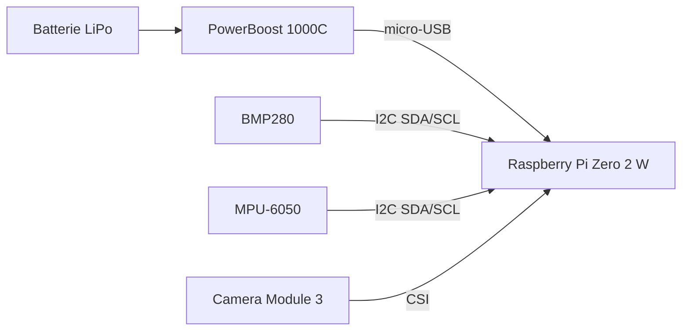
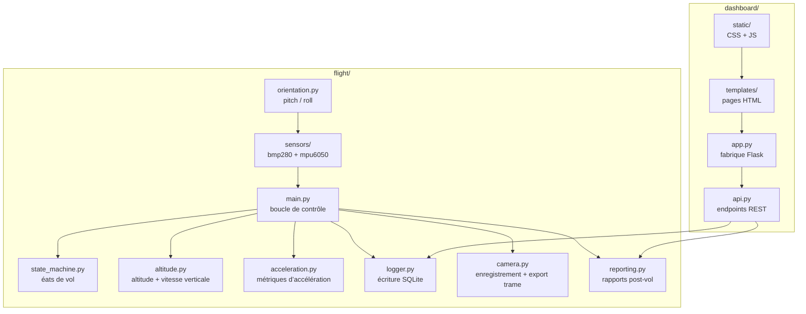

# Architecture du Rocket Flight Computer

## Vue d’ensemble

Rocket Flight Computer est une pile avionique pour une fusée modèle, exécutée sur un Raspberry Pi Zero 2 W. Le système est divisé en deux processus indépendants qui partagent une base SQLite :

```text
+-----------------------+        +------------------+        +------------------------+
| Contrôleur de vol     | -----> | SQLite (partagée)| <----- | Dashboard / UI Flask   |
| flight/main.py        |        | db/rocket.db     |        | dashboard/app.py       |
+-----------------------+        +------------------+        +------------------------+
           |
           +--> Thread caméra, enregistrement H.264, sortie de trame MJPEG
```

Cette séparation donne au système une frontière de panne claire :

- le contrôleur de vol continue à échantillonner et journaliser même si le dashboard est indisponible
- le dashboard peut redémarrer sans arrêter la boucle de contrôle temps réel

## Architecture physique

### Matériel principal

La charge utile de la fusée utilise cinq blocs matériels principaux :

- Raspberry Pi Zero 2 W comme ordinateur principal
- PowerBoost 1000C avec batterie LiPo comme source d’alimentation
- BMP280 comme capteur barométrique de pression et de température
- MPU-6050 comme centrale inertielle pour l’accélération et la vitesse angulaire
- Camera Module 3 du Raspberry Pi pour la vidéo embarquée

### Câblage physique

Le câblage confirmé est le suivant :



Remarques :

- le PowerBoost et la LiPo alimentent le Pi via l’entrée micro-USB
- la broche 5V du header GPIO du Pi n’est pas utilisée pour l’alimentation dans ce montage
- les capteurs partagent le bus I2C sur GPIO 3 (SDA) et GPIO 5 (SCL)
- la masse est commune entre le Pi, le PowerBoost et les modules capteurs

### Carte matérielle

| Composant | Interface | Adresse / connecteur | Rôle |
| --- | --- | --- | --- |
| Raspberry Pi Zero 2 W | Entrée d’alimentation micro-USB | Port USB d’alimentation | Plateforme de calcul principale |
| PowerBoost 1000C + LiPo | Alimentation | micro-USB vers le Pi | Alimentation autonome embarquée |
| BMP280 | I2C | `0x77` | Pression et température |
| MPU-6050 | I2C | `0x68` | Accélération et gyroscope |
| Camera Module 3 | CSI | Connecteur caméra | Enregistrement et flux de prévisualisation |

## Architecture d’exécution

### Contrôleur de vol

`flight/main.py` pilote la boucle de contrôle. À chaque cycle :

1. lecture des capteurs disponibles
2. calcul de l’altitude et de la vitesse verticale
3. calcul de l’accélération totale et de l’accélération nette
4. mise à jour de la machine d’état de vol
5. enregistrement de la mesure dans SQLite
6. prise en compte des commandes du dashboard stockées dans `config`
7. synchronisation de l’état de la caméra

La fréquence d’échantillonnage dépend de l’état courant :

- `IDLE` et `ARMED` : `sample_rate_idle`
- `ASCENT`, `APOGEE`, `DESCENT` : `sample_rate_flight`

### Machine d’état

`flight/state_machine.py` modélise le cycle de vol :

```text
IDLE -> ARMED -> ASCENT -> APOGEE -> DESCENT -> LANDED
```

Règles actuelles :

- la détection du lancement exige que l’altitude, la vitesse verticale et l’accélération nette dépassent des seuils
- l’apogée est confirmée après un nombre configurable d’échantillons consécutifs en baisse
- l’atterrissage est confirmé après une durée configurable d’altitude stable
- le désarmement n’est autorisé qu’à partir de l’état `ARMED`

### Couche capteurs

Les pilotes capteurs se trouvent dans `flight/sensors/` :

- `bmp280.py` : pression et température via I2C
- `mpu6050.py` : mesures IMU avec une voie principale et un repli SMBus

Le pilote IMU dérive `pitch` et `roll` à l’aide de `flight/orientation.py`.

Convention d’orientation :

- `pitch` : rotation autour de l’axe Y
- `roll` : rotation autour de l’axe X
- `yaw` : reste actuellement à `0.0` car aucun fusionnement basé sur magnétomètre n’est implémenté

### Données dérivées

Deux modules auxiliaires calculent les valeurs utilisées ailleurs dans le système :

- `flight/altitude.py`
  - initialise automatiquement une pression de référence
  - calcule l’altitude à partir de la pression barométrique
  - dérive la vitesse verticale à partir des variations d’altitude
- `flight/acceleration.py`
  - calcule `total_accel` comme norme du vecteur d’accélération
  - calcule `net_accel` comme `max(0, total_accel - 9.81)`

### Journalisation de vol

`flight/logger.py` écrit la télémétrie dans SQLite via `FlightDB`.

La journalisation démarre quand le contrôleur entre dans `ARMED` et s’arrête quand le contrôleur atteint `LANDED`. Les résumés de vol sont écrits dans la table `flights` à la fin d’un vol.

### Chaîne caméra

`flight/camera.py` gère la vidéo embarquée :

- enregistre du H.264 sur disque
- exporte la dernière image JPEG dans un fichier partagé en mémoire RAM
- permet au dashboard de servir un flux MJPEG sans posséder la caméra

Le dashboard lit ce fichier via `/api/camera/stream`.

## Modèle de données

`flight/database.py` est un wrapper SQLite léger. Le schéma se trouve dans `db/schema.sql`.

### `readings`

Une ligne par échantillon de télémétrie :

```sql
id | flight_id | timestamp | pressure | temperature | altitude | vspeed |
roll | pitch | yaw | accel_x | accel_y | accel_z | total_accel | net_accel | state
```

Remarques :

- `flight_id` relie un échantillon à un vol enregistré lorsqu’un vol est actif
- `state` stocke l’état du contrôleur au moment de l’échantillon

### `flights`

Une ligne par vol :

```sql
id | started_at | ended_at | max_altitude | max_vspeed | max_net_accel | duration | state
```

### `config`

Configuration partagée à l’exécution :

```sql
key | value | updated_at
```

Le dashboard écrit dans cette table et le contrôleur de vol la recharge périodiquement.

## Architecture du dashboard

`dashboard/app.py` crée l’application Flask et y attache :

- une instance partagée de `FlightDB`
- une instance partagée de `ConfigManager`
- une instance partagée de `FlightReportManager`
- le blueprint API provenant de `dashboard/api.py`

L’application expose aussi l’instance de `StateMachine` et le chemin configuré du fichier de trame caméra.

### Surface API

Endpoints actuels :

- `GET /api/status`
- `GET /api/history`
- `GET /api/flights`
- `GET /api/config`
- `POST /api/config`
- `POST /api/arm`
- `POST /api/disarm`
- `POST /api/calibrate`
- `GET /api/hardware`
- `GET /api/camera/stream`
- `GET /api/reports`
- `GET /api/reports/<flight_id>`
- `GET /api/reports/<flight_id>/assets/<filename>`

`/api/hardware` a deux responsabilités :

- scanner le bus I2C pour détecter le BMP280 et le MPU-6050
- reporter l’état de sous-tension du Raspberry Pi via `vcgencmd get_throttled`

## Flux de communication

### Du dashboard vers le contrôleur de vol

Les commandes sont écrites dans la table `config` :

- demande d’armement
- demande de désarmement
- demande de recalibration de l’altitude
- mise à jour des paramètres d’échantillonnage et de machine d’état

Le contrôleur de vol interroge la configuration environ une fois par seconde et consomme ces demandes.

### Du contrôleur de vol vers le dashboard

La télémétrie transite par la table `readings` et les résumés de vol par `flights`.

Cette conception rend le dashboard en lecture seule pour l’historique de télémétrie et facilite l’inspection avec des outils SQLite standards.

### De la caméra vers le dashboard

Le chemin caméra est basé sur un fichier plutôt que sur la base de données :

1. le thread caméra écrit la dernière image JPEG dans un fichier connu
2. le dashboard lit ce fichier lorsqu’il sert `/api/camera/stream`

Cela évite de stocker des images binaires dans SQLite.

### Chaîne des rapports

Après la fin d’un vol, le contrôleur déclenche la génération des rapports via `FlightReportManager`.

Le pipeline de rapport :

1. lit la télémétrie depuis SQLite
2. construit des résumés bruts et lissés
3. rend des graphiques pour l’altitude, la température, l’accélération verticale et l’accélération nette
4. copie ou relie les assets vidéo lorsqu’ils sont disponibles
5. écrit un manifeste dans le répertoire de rapports

Les rapports générés sont servis par le dashboard via `/api/reports`.

## Gestion des erreurs

Le code suit une logique de dégradation progressive :

- les erreurs de lecture capteur retournent `None` au lieu de faire planter la boucle
- le contrôleur principal intercepte les exceptions dans `run()`
- le dashboard peut continuer à servir des informations partielles ou obsolètes si certaines sondes matérielles échouent
- l’absence d’outils Raspberry Pi comme `i2cdetect` ou `vcgencmd` dégrade le retour sur l’état matériel sans arrêter l’application
- si la génération de rapport ou la capture caméra échoue, le reste du système continue à fonctionner

## Structure du code

Le dépôt est organisé par responsabilité plutôt que par couche d’interface. Les chemins principaux sont explicites :



En résumé :

- `flight/` gère l’acquisition, les calculs, l’état, la journalisation, la caméra et les rapports
- `dashboard/` gère l’interface web et l’API REST
- `db/` définit le schéma SQLite partagé
- `config/` contient les fichiers de déploiement et de service
- `tests/` reflète les modules d’exécution avec des tests unitaires et d’API ciblés

## Contraintes actuelles

Quelques limites d’architecture méritent d’être explicitées :

- la transmission des commandes du dashboard vers le contrôleur repose sur du polling, pas sur de l’événementiel
- le flux vidéo dépend d’un fichier de trame partagé
- les écritures SQLite sont synchrones à chaque échantillon journalisé
- le yaw n’est pas estimé au-delà des valeurs de base émises par la chaîne IMU
- la génération des rapports est effectuée après la fin du vol, et non en continu

## Chemins d’exécution et variables

Chemins utilisés par défaut par l’application :

- base de données : `db/rocket.db` ou `ROCKET_DB`
- fichier de trame caméra : `/dev/shm/rocket_camera_frame.jpg` ou `ROCKET_CAMERA_FRAME_FILE`
- répertoire des rapports : `/opt/rocket/data/reports` ou `ROCKET_REPORT_DIR`
- répertoire vidéo : `/opt/rocket/data/videos` ou `ROCKET_VIDEO_DIR`

## Évolutions possibles

Étapes futures raisonnables :

1. introduire une meilleure fusion IMU pour une estimation d’orientation plus fiable
2. ajouter des outils d’export pour les vols enregistrés
3. rendre la propagation des commandes événementielle au lieu du polling périodique
4. renforcer la journalisation opérationnelle autour de la caméra et des défaillances capteurs
5. étendre le transport de télémétrie au-delà du Wi-Fi local si des essais longue portée sont nécessaires